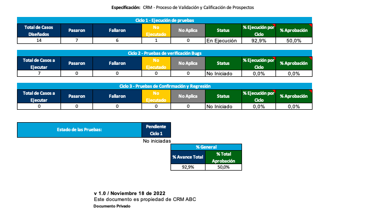

# Reporte de avance del plan de pruebas

Como se muestra en la imagen anterior, en el primer ciclo de pruebas se ejecuto un 92,9 % de las pruebas en donde hubo una aprobación del 50 % de los casos de pruebas diseñados para ampliar la información ver el documento [Plan de pruebas](B2B-2377 Diseño y ejecución casos de prueba.xlsx)
# Reporte de incidentes de la prueba de aceptación
Este reporte de incidente es para el proyecto CRM de la empresa ABC.

## BUG01 - DCP06 - Error en la validación de datos faltantes en una persona natural
### Prioridad:
Media
### Descripción
El sistema no muestra un mensaje de error cuando faltan datos obligatorios en una persona natural.
### Pasos para reproducir el error
1. Ejecutar el Caso de Prueba 6: Validación de datos faltantes en una persona natural.
2. Crear un nuevo prospecto persona natural sin ingresar el número de documento.
3. Guardar los datos del prospecto.
### Resultado esperado
El sistema debe mostrar un mensaje de error indicando que el número de documento es un campo obligatorio.
### Resultado obtenido
El sistema no muestra ninguna notificación o mensaje de error indicando el dato faltante.


## BUG02 - DCP07 - Inconsistencia en la validación de datos de una persona jurídica existente
### Prioridad:
Alta
### Descripción
El sistema no verifica correctamente los datos de una persona jurídica existente.
### Pasos para reproducir el error
1. Ejecutar el Caso de Prueba 7: Validación de datos de una persona jurídica existente. 
2. Seleccionar una persona jurídica existente. 
3. Modificar el campo "Representante legal" en el sistema de identificación externo.
### Resultado esperado
El sistema debe detectar la inconsistencia en los datos y mostrar una notificación indicando la discrepancia.
### Resultado obtenido
El sistema muestra que los datos coinciden a pesar de que el representante legal ha sido modificado en el sistema externo.

## BUG03 - DCP04 - Error en la validación de antecedentes judiciales de una persona
### Prioridad:
Alta
### Descripción
El sistema no muestra un mensaje de error cuando no se encuentran antecedentes judiciales para una persona.
### Pasos para reproducir el error
1. Ejecutar el Caso de Prueba 4: Validación de antecedentes judiciales de una persona.
2. Seleccionar una persona con antecedentes judiciales registrados.
3. Iniciar la verificación de antecedentes judiciales.
### Resultado esperado
El sistema debe detectar los antecedentes judiciales y mostrar una notificación indicando su existencia.
### Resultado obtenido
El sistema muestra una notificación indicando que no existen antecedentes judiciales para la persona, a pesar de que los antecedentes están presentes.

## BUG04 - DCP02 - Puntaje financiero no obtenido correctamente para una persona
### Prioridad:
media
### Descripción
El sistema no calcula correctamente el puntaje financiero de una persona.
### Pasos para reproducir el error
1. Ejecutar el Caso de Prueba 2: Obtención exitosa del puntaje financiero de una persona. 
2. Seleccionar una persona. 
3. Obtener el puntaje financiero del sistema de calificación de prospectos.
### Resultado esperado
El sistema debe obtener correctamente el puntaje financiero de la persona y mostrarlo correctamente.
### Resultado obtenido
El sistema muestra un valor incorrecto o nulo como puntaje financiero

## BUG05 - DCP01 - Error en la adición de prospecto al sistema de contactos
### Prioridad: 
Alta
### Descripción
El sistema permite agregar un prospecto con puntaje inferior a 0.6 al sistema de contactos.
### Pasos para reproducir el error
1. Ejecutar el Caso de Prueba 16: Adición de prospecto al sistema de contactos. 
2. Seleccionar un prospecto con puntaje igual o inferior a 0.6. 
3. Intentar agregar al prospecto al sistema de contactos.
### Resultado esperado
El sistema debe mostrar un mensaje indicando que el puntaje del prospecto no cumple con el requisito mínimo para ser agregado al sistema de contactos.
### Resultado obtenido
El sistema permite agregar al prospecto a pesar de tener un puntaje inferior a 0.6.

```python
TESTER: JORGE EIDER VÁSQUEZ URRUTIA
CICLO DE PRUEBAS: 1
FECHA: 2023-07-10
HORA: 10:00
```

